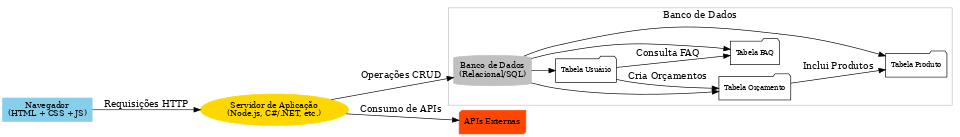

## 4. Projeto da Solução

O projeto de solução para a aplicação "Sua Obra Aqui" é voltado para simplificar o gerenciamento de orçamentos e informações relacionadas a obras, conectando clientes e profissionais do setor de construção civil. A arquitetura da aplicação é baseada em uma estrutura de front-end e back-end, composta por uma interface web desenvolvida com HTML, CSS e JavaScript, e um servidor de aplicação robusto utilizando Node.js ou C# para lidar com a lógica de negócios e processamento de dados. O banco de dados relacional armazena informações essenciais sobre usuários, produtos, orçamentos e perguntas frequentes (FAQ), garantindo a integridade e segurança dos dados.

O projeto oferece um sistema de cadastro de usuários que permite o acesso seguro à aplicação e funcionalidades como o cadastro de produtos, criação e gerenciamento de orçamentos, e consulta de respostas no FAQ. Além disso, APIs externas são integradas para enriquecer as informações fornecidas sobre produtos e serviços, otimizando o planejamento das obras.

A modelagem de dados é organizada para garantir um relacionamento claro entre entidades como Usuários, Produtos, Orçamentos, Profissionais e FAQ. A comunicação entre o navegador do usuário e o servidor é feita de forma segura e eficiente, e o sistema é projetado para ser responsivo, oferecendo uma experiência de uso consistente em diferentes dispositivos. O foco principal é fornecer aos usuários uma ferramenta intuitiva e prática para gerenciar suas necessidades relacionadas a obras, com ênfase em acessibilidade e eficiência.

## 4.1. Arquitetura da solução

A arquitetura do projeto "Sua Obra Aqui" foi planejada para garantir uma experiência de usuário intuitiva e uma comunicação eficiente entre todos os componentes da aplicação. Abaixo, é apresentado o diagrama de arquitetura que ilustra como os módulos e tecnologias interagem.

Arquitetura da Aplicação: Projeto "Sua Obra Aqui"

Descrição do Diagrama
O diagrama acima representa a arquitetura de um projeto que visa ajudar os usuários a gerenciar orçamentos e informações relacionadas a obras e construção. A solução é composta pelos seguintes componentes principais:

Navegador do Usuário: A interface de usuário onde os clientes interagem com a aplicação. A interface é construída usando tecnologias como HTML, CSS e JavaScript, oferecendo uma navegação simples e intuitiva.

Servidor de Aplicação: Responsável por processar as requisições dos usuários, validar dados, executar a lógica de negócios e fornecer respostas adequadas. Essa camada é construída utilizando tecnologias de back-end, como Node.js ou C# (.NET).

Banco de Dados: Armazena as informações essenciais da aplicação. As principais tabelas incluem dados sobre usuários, produtos cadastrados, orçamentos criados e perguntas frequentes (FAQ). A integridade e consistência dos dados são mantidas através de chaves primárias e estrangeiras.

APIs Externas: Para funcionalidades que dependem de dados de terceiros, o servidor de aplicação se conecta a APIs externas, permitindo integrar e consumir informações externas relevantes.

Componentes Detalhados
Cadastro de Usuário: Permite aos usuários se cadastrarem, gerenciar suas credenciais e acessar o sistema.
Orçamento: Módulo onde o usuário cria e visualiza orçamentos baseados em produtos cadastrados.
FAQ: Uma seção de Perguntas Frequentes para guiar os usuários sobre dúvidas comuns.
Cadastro de Produtos: Administração dos produtos cadastrados na aplicação.
 
 
 

### 4.2. Protótipos de telas

Visão geral da interação do usuário pelas telas do sistema e protótipo interativo das telas com as funcionalidades que fazem parte do sistema (wireframes).
Apresente as principais interfaces da plataforma. Discuta como ela foi elaborada de forma a atender os requisitos funcionais, não funcionais e histórias de usuário abordados nas <a href="02-Especificação do Projeto.md"> Especificação do Projeto</a>.
A partir das atividades de usuário identificadas na seção anterior, elabore o protótipo de tela de cada uma delas.

São protótipos usados em design de interface para sugerir a estrutura de um site web e seu relacionamentos entre suas páginas. Um wireframe web é uma ilustração semelhante do layout de elementos fundamentais na interface.
 
> **Links Úteis**:
> - [Protótipos vs Wireframes](https://www.nngroup.com/videos/prototypes-vs-wireframes-ux-projects/)
> - [Ferramentas de Wireframes](https://rockcontent.com/blog/wireframes/)
> - [MarvelApp](https://marvelapp.com/developers/documentation/tutorials/)
> - [Figma](https://www.figma.com/)
> - [Adobe XD](https://www.adobe.com/br/products/xd.html#scroll)
> - [Axure](https://www.axure.com/edu) (Licença Educacional)
> - [InvisionApp](https://www.invisionapp.com/) (Licença Educacional)

## Diagrama de Classes

O diagrama de classes ilustra graficamente como será a estrutura do software, e como cada uma das classes da sua estrutura estarão interligadas. Essas classes servem de modelo para materializar os objetos que executarão na memória.

As referências abaixo irão auxiliá-lo na geração do artefato “Diagrama de Classes”.

> - [Diagramas de Classes - Documentação da IBM](https://www.ibm.com/docs/pt-br/rational-soft-arch/9.6.1?topic=diagrams-class)
> - [O que é um diagrama de classe UML? | Lucidchart](https://www.lucidchart.com/pages/pt/o-que-e-diagrama-de-classe-uml)

### 4.3. Modelo de dados

O desenvolvimento da solução proposta requer a existência de bases de dados que permitam efetuar os cadastros de dados e controles associados aos processos identificados, assim como recuperações.
Utilizando a notação do DER (Diagrama Entidade e Relacionamento), elaborem um modelo, na ferramenta visual indicada na disciplina, que contemple todas as entidades e atributos associados às atividades dos processos identificados. Deve ser gerado um único DER que suporte todos os processos escolhidos, visando, assim, uma base de dados integrada. O modelo deve contemplar, também, o controle de acesso de usuários (partes interessadas dos processos) de acordo com os papéis definidos nos modelos do processo de negócio.
_Apresente o modelo de dados por meio de um modelo relacional que contemple todos os conceitos e atributos apresentados na modelagem dos processos._

#### 4.3.1 Modelo ER

#### 4.3.2 Esquema Relacional

O Esquema Relacional corresponde à representação dos dados em tabelas juntamente com as restrições de integridade e chave primária.
 

#### 4.3.3 Modelo Físico

Com base no diagrama ER fornecido, o modelo físico detalhado pode ser desenvolvido para um banco de dados relacional. Abaixo está uma proposta de estrutura, incluindo tabelas, colunas, tipos de dados e relacionamentos:

### Tabelas e Estruturas

1. **Usuario**
   - `Id_usuario` (PK) - INT
   - `Nome` - VARCHAR(100)
   - `Email` - VARCHAR(100)
   - `Senha` - VARCHAR(255)

2. **Cadastro_usuario**
   - `Id_cadastro` (PK) - INT
   - `Id_usuario` (FK) - INT (REFERENCES Usuario(Id_usuario))
   - `Data_cadastro` - DATETIME

3. **Cadastro_mao_de_obra**
   - `Id_cadastro` (PK) - INT
   - `Id_profissional` (FK) - INT (REFERENCES Profissional(Id_profissional))
   - `Data_cadastro` - DATETIME

4. **Cliente**
   - `Id_cliente` (PK) - INT
   - `Nome` - VARCHAR(100)
   - `Email` - VARCHAR(100)
   - `Senha` - VARCHAR(255)

5. **Orçamento**
   - `Id_orçamento` (PK) - INT
   - `Id_cliente` (FK) - INT (REFERENCES Cliente(Id_cliente))
   - `Tipo_projeto` - VARCHAR(100)
   - `Área` - FLOAT
   - `Preco_total` - DECIMAL(10, 2)

6. **Material**
   - `Id_material` (PK) - INT
   - `Nome` - VARCHAR(100)
   - `Unidade_medida` - VARCHAR(50)
   - `Preco_unidade` - DECIMAL(10, 2)

7. **Suporte**
   - `Id_suporte` (PK) - INT
   - `Id_cliente` (FK) - INT (REFERENCES Cliente(Id_cliente))
   - `Descricao_problema` - TEXT
   - `Status` - VARCHAR(50)

8. **Avaliacao**
   - `Id_avaliacao` (PK) - INT
   - `Id_profissional` (FK) - INT (REFERENCES Profissional(Id_profissional))
   - `Id_cliente` (FK) - INT (REFERENCES Cliente(Id_cliente))
   - `Nota` - INT
   - `Comentario` - TEXT

9. **Recomendacao**
   - `Id_recomendacao` (PK) - INT
   - `Id_cliente` (FK) - INT (REFERENCES Cliente(Id_cliente))
   - `Id_profissional` (FK) - INT (REFERENCES Profissional(Id_profissional))

10. **Profissional**
    - `Id_profissional` (PK) - INT
    - `Nome` - VARCHAR(100)
    - `Email` - VARCHAR(100)
    - `Senha` - VARCHAR(255)
    - `Especializacao` - VARCHAR(100)
    - `Experiencia` - TEXT

11. **FAQ**
    - `Id_faq` (PK) - INT
    - `Pergunta` - TEXT
    - `Resposta` - TEXT

12. **Produto**
    - `Id_produto` (PK) - INT
    - `Nome` - VARCHAR(100)
    - `Unidade_medida` - VARCHAR(50)
    - `Preco` - DECIMAL(10, 2)

13. **Atualizacao_Produto**
    - `Id_atualizacao` (PK) - INT
    - `Id_produto` (FK) - INT (REFERENCES Produto(Id_produto))
    - `Data_atualizacao` - DATETIME

14. **Orcamento_Material**
    - `Id_orcamento` (FK) - INT (REFERENCES Orçamento(Id_orçamento))
    - `Id_material` (FK) - INT (REFERENCES Material(Id_material))
    - `Quantidade` - FLOAT

### Considerações Adicionais

- **Índices**: Adicionar índices nas colunas usadas frequentemente em consultas, como `Email` em `Usuario` e `Profissional`, pode melhorar a performance.
- **Tipos de Dados**: Ajustar tipos conforme a necessidade do sistema (e.g., tamanho de `VARCHAR`, precisão de `DECIMAL`).
- **Chaves Estrangeiras**: Garantir que todas as FK mantenham a integridade referencial.
- **Normalização**: O modelo é estruturado para evitar redundância e garantir consistência.

Este modelo físico serve como uma base para a criação das tabelas em um banco de dados SQL.

### 4.4. Tecnologias

Seguindo o planejamento apresentado na subseção anterior e considerando a experiência e a comodidade dos autores deste projeto, foram escolhidas tecnologias específicas para desenvolver os sistemas que compõem este projeto. Optou-se pelo uso de HTML, CSS e JavaScript para a criação do front-end, utilizando-se da IDE Visual Studio Code. Esta ferramenta foi escolhida por sua facilidade de uso e pela disponibilidade de recursos, como o plugin Live Server, que permite simular o comportamento do navegador em tempo real, facilitando o desenvolvimento e a visualização de alterações de forma ágil. 

Para o back-end, foi utilizado o SGBD (Sistema de Gerenciamento de Banco de Dados) MySQL, devido à sua confiabilidade e compatibilidade com o ambiente de desenvolvimento. O design das interfaces e protótipos foi feito no Figma, proporcionando uma visão clara da experiência do usuário antes da implementação final. 

A modelagem dos processos foi feita com o auxílio das ferramentas Draw.io e Bizagi, que permitem uma criação visual e intuitiva dos fluxos de trabalho e arquitetura do sistema. Além disso, foram empregadas as ferramentas Git e GitHub para versionamento e desenvolvimento colaborativo, facilitando o controle de versões e a colaboração entre os membros da equipe. Essas ferramentas foram fundamentais para garantir a organização e a integridade do código durante o desenvolvimento do projeto.

| **Dimensão**       | **Tecnologia**  |
| ---                | ---             |
| Front end          | HTML+CSS+JS     |
| IDE                | VS CODE         |
| Back end           | My SQL          |
| Design             | Figma           |
| Modelagem          | Draw.io, Bizagi |
| Controle de Versão | Git, GitHub     |

